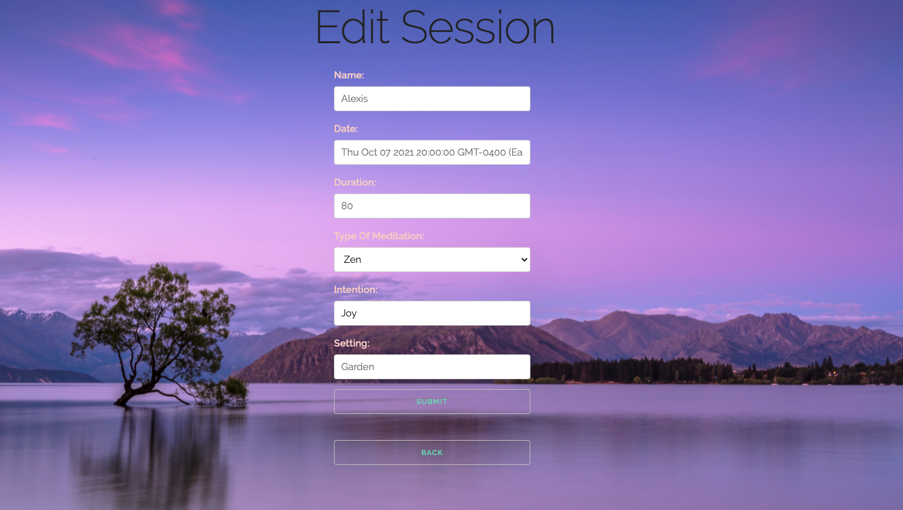

# Mindfulness App 

Allows user to track meditation and mindfulness practice. Provides fields for intention, setting, duration, date, and type of meditation.

https://mindfulnessapp.herokuapp.com/

# Getting Started

Sign up and log in. The home page is your current meditation you will log in. There is a built in timer that you can use to keep track. 

# Technologies Used

- HTML, CSS, JavaScript/jQuery
- Mongoose
- MongoDB
- Heroku
- Node JS
- Express

# Screenshots

# Future Enhancements

- Add a variety of sounscapes 
- Ability to add up the duration of all sessions combined
- Option for a guided meditation
- Goals and affirmations tracker
